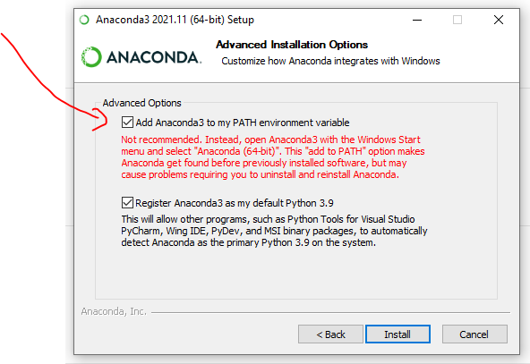

# Configuração Remota

Repositório com instruções para configuração de ferramentas para uso em acesso remoto.

## Sumário

* [Pré-requisitos](#pré-requisitos)
* [Instalação](#instalação)
* [Instruções de uso](#instruções-de-uso)

## Pré-requisitos

Este repositório requer a última versão do [Python Anaconda](https://www.anaconda.com/download) para ser executado, 
visto que usa o gerenciador de pacotes conda. O código executará em qualquer Sistema Operacional, mas foi desenvolvido
originalmente para Windows 10 Pro (64 bits).

É importante marcar esta opção no instalador do Anaconda:



## Instalação

Pela linha de comando, execute o comando

```bash
conda env create -f python/henry.yml
```

Faça isso para todas as pastas dentro da pasta `python`.

## Instruções de Uso

Teste se todas as bibliotecas foram instaladas com sucesso, executando os seguintes comandos na linha de comando:

```bash
conda activate henry
python python/test_libraries.py
```
